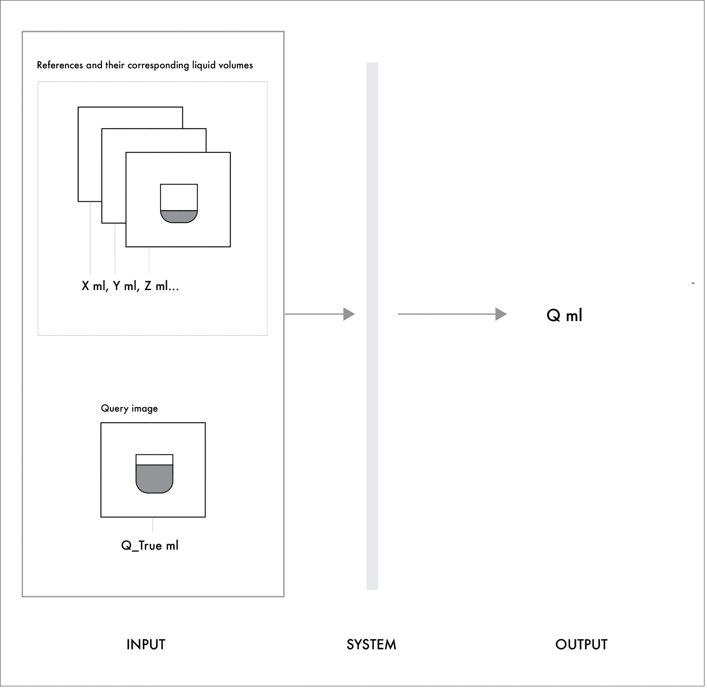
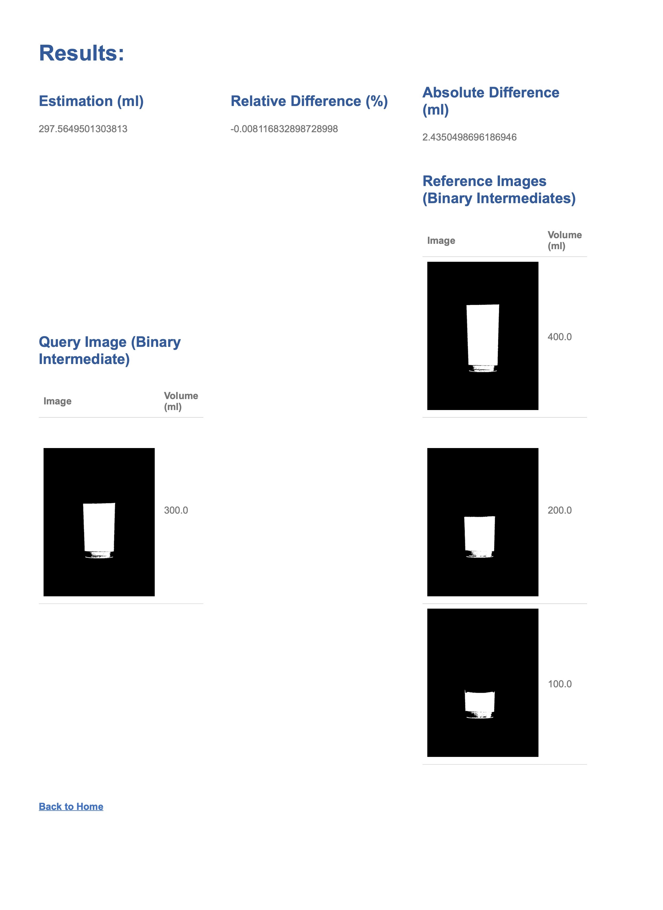

<!-- # COMS4735_project -->

<h1>Estimating volumes of colored liquids in transparent, colorless, rotationally symmetric containers</h1>

Completed May 2023 for COMS 4735 taught by Professor John Kender, Columbia University

<h2>Project Introduction:</h2>
The objective of this project is to develop a visual interface for estimating volumes of colored liquids in transparent, colorless, rotationally symmetrical vessels placed on horizontally flat surfaces. For instance, a user may want to determine the volume of Coca-Cola or orange juice in a symmetrical water glass. By supplying the system with a query and a set of reference images of a common vessel containing known liquid volumes, an estimate of the query’s liquid volume (ml) can be generated. The system estimates the query volume by mapping a 2-dimensional image to a 3-dimensional metric without the need for depth information. During this project, existing research and projects were sampled. 
  

Extensive domain engineering and testing were required to ensure a final system success rate of >88.8% in estimating volumes within a margin of +/- 15ml.

  

  

 

<h2>System specification and design:</h2>
<ul>
    <li><b>Languages:</b> Python 3.9, HTML, CSS, Javascript</li>
    <li><b>Libraries:</b> Flask, OpenCV</li>
    <li><b>System input: </b>
        <ol>
            <li>Reference images with known liquid volumes (ml)</li>
            <li>Query image</li>
            <li>Query ground truth volume (ml) - used only for error computation and not decision-making</li>
        </ol>
    </li>
    <li><b>Outpus:</b>
        <ul>
            <li>Estimation of liquid volume (ml) in the query (and error calculations)</li>
        </ul>
    </li>
    <li>
        <b>High-level breakdown of the algorithm:</b>
        <ol>
        <li>Reference processing:
            <ol>
                <li>Identification of colors in images using k-means clustering in every reference’s down-sampled image</li>
                <li>Segmentation of liquid from container and background in every original reference image using identified liquid color</li>
                <li>Volume estimation of liquid in original reference image using integral calculus (disc method) based on identified liquid areas</li>
                <li>Computation of cubic-pixel-to-ml conversion factors</li>
            </ol>
        </li>
        <li><b>Query processing:</b>
            <ol>
                <li>Identification of colors in images using k-means clustering in every reference’s down-sampled image</li>
                <li>Segmentation of liquid from container and background in every original reference image using identified liquid color</li>
                <li>Volume estimation of liquid in original reference image using integral calculus (disc method) based on identified liquid areas</li>
                <li>Cubic pixel volume comparison with references to determine best conversion factor. Two methods, linear interpolation and closest reference, are used to determine conversion factors.</li>
                <li>Mapping of cubic pixel volume to ml volume using determined conversion factors</li>
            </ol>
        </li>
        <li><b>Output result:</b> system estimation liquid volume and errors</li>
    </ol>
    </li>
</ul>

<h2>Project Report:</h2>
<ul>
    <li><a href="./kl3285_project_report.pdf">Link to project report</a></li>
</ul>

<h2>Project Code:</h2>
<ul>
    <li><a href="system.py">Link to system code.</a></li>
    <li><a href="app.py">Link to back-end server.</a></li>
    <li><a href="index.html">Link to front-end interface.</a></li>
</ul>
